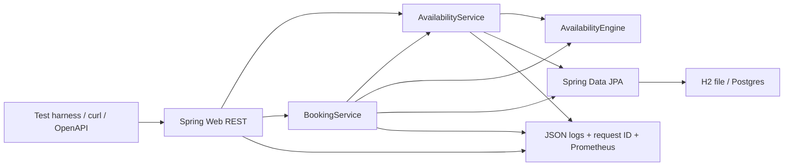
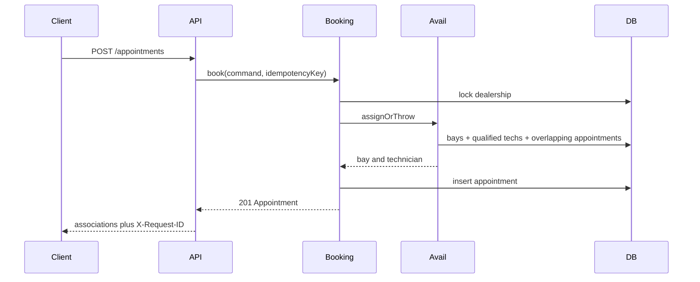

# Unified Service Scheduler — System Design

Keyloop Scenario A (Ownership). Backend service that replaces a manual workshop diary with **resource-constrained booking**: a desired time is confirmed only when a **service bay** and a **qualified technician** are free for the **full duration**.

Client layer is mocked via OpenAPI (`/docs`) and curl examples in the README.

## Architecture



### Component roles

| Component | Role |
|---|---|
| `SchedulerController` | HTTP contract, validation, status codes. No scheduling rules. |
| `AvailabilityEngine` | Pure domain: half-open overlap, dealer hours, 30-minute grid, assignment. |
| `AvailabilityService` | Loads dealership-scoped bays, qualified techs, and the day's busy intervals (three queries), then matches in memory. Used by **GET** and **POST**. |
| `BookingService` | Desired-time confirm: integrity checks, lock dealership row, re-check availability inside the transaction, persist `Appointment`, idempotency. |
| JPA + Flyway | Schema and indexes. H2 file for the demo; same mappings target Postgres. |
| Observability | `X-Request-ID`, JSON logs, `/metrics`, `/health`, `/ready`. |

## Data flow

1. Advisor (or test harness) `POST /appointments` with customer, vehicle, dealership, service type, **desired `startAt`**, and `Idempotency-Key`.
2. API validates ISO-8601 timestamps **with offset** (naive datetimes → 422).
3. Booking transaction:
   - `SELECT … FOR UPDATE` on the dealership (serializes confirms per site).
   - Load customer/vehicle/service; reject unknown ids (404), ownership mismatch (422), service not offered (422).
   - Duration comes from the **service-type catalog**, not the client.
   - Same engine as availability: hours, grid, not in the past, `endAt` ≤ close in `Dealership.timezone`.
   - Vehicle overlap on confirmed rows → 409 `VEHICLE_OVERLAP`.
   - Pick first free bay + qualified tech for `[start, end)`.
   - Insert `CONFIRMED` appointment linking customer, vehicle, technician, bay.
4. `GET /availability` is a diary search for a calendar date. It does **not** reserve. Booking is authoritative.



## Assumptions (explicit)

- A booking request is `POST /appointments` with an existing customer, a vehicle **owned by that customer**, a dealership, a service type offered at that site, and a desired `startAt`. There is no hold/reserve step.
- If the desired time cannot be staffed for the full duration, the API returns **409** with a reason code. This build does not return next-available alternatives.
- The **server** selects one eligible bay and one eligible technician. Availability may show example candidates; the confirmed record is authoritative.
- Every appointment consumes exactly one bay and one technician for `[startAt, endAt)`. Multi-bay and multi-tech jobs are out of scope.
- A technician is qualified iff they belong to the dealership and their skills include the service type's `requiredSkill`. Grades, OEM certs, and language are out of scope.
- Bays at the seeded dealer accept MOT and MECHANICAL work. Cross-dealership use of bays is rejected.
- Each dealership has an IANA timezone. Hours are **08:00–17:00 Monday–Friday** in that timezone. Slot starts are every 30 minutes. Jobs must not start in the past and must finish by close. Overnight and weekend work are rejected.
- `endAt = startAt + ServiceType.durationMinutes`. Duration does not vary by vehicle.
- Only non-cancelled (`cancelledAt IS NULL`) rows occupy a bay, technician, or vehicle. Cancel is idempotent. There is no reschedule API (change = cancel + new book).
- Customers and vehicles are **seed fixtures**. VIN is stored for the mock client; the API keys vehicles by id. VIN search is out of scope.
- No authentication. We assume a trusted service advisor. Timestamps are stored in UTC; dealer-local interpretation uses `Dealership.timezone`.
- Walk-ins, waiters, parts, SMS, lunch, leave, and pin-this-bay are out of scope. Availability therefore **overstates** real workshop capacity.
- Two simultaneous confirms for overlapping resources: one 201, one 409.

## Data model

- `Dealership` (timezone)
- `Customer`, `Vehicle` (belongs to customer; VIN + registration)
- `ServiceType` (duration + required skill)
- `DealershipServiceType` (site catalogue)
- `ServiceBay`, `Technician` (skills)
- `Appointment` (customer, vehicle, technician, bay, start/end, status, cancelledAt)
- `IdempotencyKey`

Overlap (half-open): `existing.startAt < requested.endAt AND existing.endAt > requested.startAt`.

## API

| Method | Path | Purpose |
|---|---|---|
| GET | `/health` | Liveness (no I/O) |
| GET | `/ready` | `SELECT 1` |
| GET | `/metrics` | Prometheus text |
| GET | `/docs` | OpenAPI UI (client stub) |
| GET | `/dealerships` | Seeded sites |
| GET | `/dealerships/{id}/resources` | Bays, techs, service types |
| GET | `/availability` | Diary slots for a date |
| POST | `/appointments` | Desired-time confirm (`Idempotency-Key` required) |
| GET | `/appointments/{id}` | Confirmation record |
| GET | `/appointments?dealershipId=` | Site diary |
| POST | `/appointments/{id}/cancel` | Free the slot |

Error body: `{ "code", "message", "requestId" }` with codes such as `SLOT_UNAVAILABLE`, `NO_BAY`, `NO_TECH`, `OUTSIDE_HOURS`, `DURATION_PAST_CLOSE`, `VEHICLE_NOT_OWNED`, `VEHICLE_OVERLAP`, `IDEMPOTENCY_KEY_REUSED`.

## Technology choices

| Choice | Why |
|---|---|
| Java 21 | Current LTS; records, virtual-thread-ready; matches typical Keyloop/enterprise JVM estate |
| Spring Boot 3.4 | Idiomatic Java REST, validation, transactions, Actuator |
| Spring Data JPA | Portable persistence; repositories stay dealership-scoped |
| Flyway | Schema as a reviewed artefact (not `ddl-auto=update`) |
| H2 file, PostgreSQL mode | Java analogue of SQLite: embedded, persistent, zero ops. `MODE=PostgreSQL` keeps SQL close to production |
| springdoc-openapi | Generated OpenAPI UI as the mocked client |
| JUnit 5 + TestRestTemplate | Domain unit tests + HTTP tests including a double-book race |
| Micrometer Prometheus | Scrape-able booking and HTTP metrics without a sidecar |
| Logstash encoder | JSON logs with `requestId` MDC |

**Not chosen:** Python/FastAPI (superseded by this Java stack), Kafka, Kubernetes, Redis availability cache, OpenTelemetry SDK in-repo.

## Scalability, performance, reliability

- Availability is **O(A + S×B×T)** in memory after three SQL reads for the day. Nested per-slot SQL is forbidden.
- Indexes: `(dealership_id, start_at)`, `(service_bay_id, start_at, end_at)`, `(technician_id, start_at, end_at)`.
- Booking takes a **pessimistic lock** on the dealership row so two confirms cannot both observe a free Pat.
- `Idempotency-Key`: same key + same body replays 201/200; same key + different body → 409.
- H2 (like SQLite) is a **single-writer** demo. Production: PostgreSQL, `SELECT FOR UPDATE` on overlapping appointment rows, and gist exclusion constraints:

```sql
EXCLUDE USING gist (service_bay_id WITH =, tstzrange(start_at, end_at) WITH &&)
```

(and the same for `technician_id`). Connection pool via `DATABASE_URL` / Spring datasource when switching JDBC URL to Postgres.

## Observability

Single-process service. We implement logs, metrics, health, and request correlation. Distributed tracing is specified for production, not this build.

### Logging

- JSON to stdout (Logstash encoder); UTC timestamps.
- `requestId` bound in a filter (incoming `X-Request-ID` or generated UUID) and echoed on every response.
- Events: `http.request`, `availability.checked`, `booking.attempted`, `overlap.checked`, `booking.succeeded`, `booking.conflict`, `booking.rejected`, `booking.failed`.
- Bind `dealershipId` when known; `appointmentId` after insert.
- Levels: INFO success, WARN 4xx business (409/422), ERROR 5xx.
- **PII:** IDs only. No names, emails, phones, VINs, or request bodies in logs.

### Metrics

Prometheus text at `GET /metrics`:

- `http_requests_total{method,path,status}`
- `http_request_duration_seconds{method,path}`
- `booking_attempts_total{outcome}` (`success|conflict|rejected|error`)
- `booking_conflicts_total{reason}`
- `availability_duration_seconds`
- `overlap_check_duration_seconds{resource_type}`
- `db_errors_total{operation}`

### Correlation (failed booking)

`X-Request-ID` → availability check → booking transaction → overlap hit → `booking.conflict` WARN → HTTP 409 `{code, message, requestId}`. Grep the id in stdout. GET availability never reserves.

### Health

- `GET /health` — process liveness (no I/O).
- `GET /ready` — `SELECT 1` against the configured database.

### Production (not implemented)

- OpenTelemetry SDK, W3C `traceparent`, spans for `BookingService.book` and overlap queries. 409 is not a span error.
- Log aggregation (Loki/ELK), Grafana on the series above, alerts on 5xx rate and availability p99.
- Postgres `EXCLUDE` constraints; `pg_stat_statements`.
- Auth (API key / OIDC).

## How GenAI was used in design

GenAI (Cursor) was treated as a **collaborator**, not an authority.

1. **Direction:** Scenario A was chosen for the richest domain (dual-resource booking + races). The Java/Spring stack was selected after the environment had Maven but no Python, and to match a typical Keyloop JVM service.
2. **Challenge:** two review personas (meticulous client, solution architect) attacked assumptions and NFRs *before* coding. Their conditions (desired-time POST, ownership, one engine, timezone, idempotency, metrics-not-optional) were merged into this document and the code.
3. **Verification:** I owned overlap semantics, transaction locking, and tests. Generated code was compiled and run; concurrency is asserted as `{201, 409}`, not hoped for.
4. **What I rejected:** optional metrics, async SQLite, cartesian SQL, caching availability, shipping OpenTelemetry in the take-home.

## Out of scope

Frontend UI, real auth, multi-bay jobs, parts, SMS, lunch/leave, walk-ins, Kafka, Kubernetes, CQRS.
